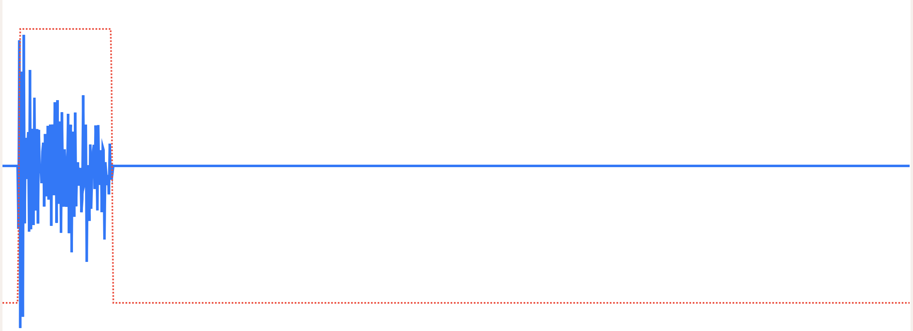

# Equalizing audio with discrete cosine transforms (DCTs)

Change the frequency response of an audio signal by manipulating frequency-domain data.

## Overview

You can use vDSP functions to shape the output of an audio signal; for example, boosting or cutting the bass or treble of a music track. 

This sample app plays a drum loop and allows the user to eliminate frequencies that are either inside or outside a range that two [`Slider`](https://developer.apple.com/documentation/swiftui/slider) controls define. 

By performing a forward DCT on the drum loop data and zeroing out parts of the audio spectrum, the sample app applies a band-pass or band-stop filter to the audio.  

When you first launch the app, the drum loop plays with a band-pass filter that eliminates very low and very high frequencies. The user interface displays the frequency-domain representation of the equalized drum loop and the shape of the envelope that defines the frequency response.


Before exploring the code, try building and running the app to familiarize yourself with the effect of the different equalizations on the drum loop.

vDSP also provides biquadratic filters that offer an alternative approach for equalizing audio. To learn more about biquadratic filters, see [Applying Biquadratic Filters to a Music Loop](https://developer.apple.com/documentation/accelerate/applying_biquadratic_filters_to_a_music_loop).

## Generate the audio samples

This sample includes an audio resource, `Rhythm.aif`, that contains a drum loop. The `getAudioSamples(forResource:withExtension:)` function generates an array of single-precision values from the drum loop.

``` swift
guard let samples = try await AudioUtilities.getAudioSamples(
    forResource: "Rhythm",
    withExtension: "aif") else {
    fatalError("Unable to parse the audio resource.")
}
```

The `samples` array contains single-precision values that represent the entire content of `Rhythm.aif`. To learn more about the [AVFoundation](https://developer.apple.com/documentation/avfoundation) classes that generate the samples, see [`AVAssetReader`](https://developer.apple.com/documentation/avfoundation/avassetreader) and [`AVAssetReaderTrackOutput`](https://developer.apple.com/documentation/avfoundation/avassetreadertrackoutput).

## Configure audio playback

The `DrumLoopProvider` class conforms to the `SignalProvider` protocol and vends an array of single-precision values that represent audio data. The `AudioEqualizationApp` application file creates an instance of `SignalGenerator` and specifies an instance of `DrumLoopProvider` as the signal provider. It also specifies the [ `naturalTimeScale`](https://developer.apple.com/documentation/avfoundation/avpartialasyncproperty/3816136-naturaltimescale) of the audio asset as the sample rate.

The `SignalGenerator.start()` function starts the signal generator.

``` swift
try? await drumLoopProvider.loadAudioSamples()
try? SignalGenerator(signalProvider: drumLoopProvider).start()
```

On return, the signal generator repeatedly calls the `getSignal()` function and renders the returned data as audio. Each call returns a page of length `sampleCount`  from `samples`.

``` swift
let start = pageNumber * Self.sampleCount
let end = (pageNumber + 1) * Self.sampleCount

let page = Array(samples[start ..< end])

pageNumber += 1

if (pageNumber + 1) * Self.sampleCount >= samples.count {
    pageNumber = 0
}
```
    
The sample can render the audio unaltered by returning `page`.

To learn more about using [AVAudioEngine](https://developer.apple.com/documentation/avfaudio/avaudioengine) to render audio, see [Building a Signal Generator](https://developer.apple.com/documentation/avfaudio/audio_engine/building_a_signal_generator).

## Define the DCT-based equalization filter

The sample app builds the envelope array — that controls which parts of the drum loop's spectrum it zeroes — from variables that define the start and end frequencies, and a value that specifies either band pass or band stop.

``` swift
let start = Float(startFrequency)
let end = Float(endFrequency)

let indices = [0, start - 2, start, end, end + 2, 1024]
let magnitudes: [Float]

switch mode {
    case .bandPass:
        magnitudes = [0, 0, 1, 1, 0, 0]
    case .bandStop:
        magnitudes = [1, 1, 0, 0, 1, 1]
}

envelope = [Float](unsafeUninitializedCapacity: DrumLoopProvider.sampleCount) {
    buffer, initializedCount in
    
    vDSP.linearInterpolate(values: magnitudes,
                           atIndices: indices,
                           result: &buffer)
    
    initializedCount = DrumLoopProvider.sampleCount
}
```

The following image visualizes the effect of audio equalization that blocks most of the spectrum except low frequencies. The solid, blue line represents the frequency-domain audio data, and the dashed red line represents the values in the band-stop filter.



## Prepare the DCT setups

The following code creates setup objects that contain all the information required to perform the forward and inverse DCT operations. Creating these setup objects can be expensive, so the sample only does this once.

The forward transform is a type II DCT.

``` swift
static let forwardDCT = vDSP.DCT(count: sampleCount,
                                 transformType: .II)!
```
    
The inverse transform is a type III DCT.

``` swift
static let inverseDCT = vDSP.DCT(count: sampleCount,
                                 transformType: .III)!
```

## Equalize the audio with DCT

To equalize the audio using a DCT-based filter, the sample app applies a forward DCT transform to the time-domain signal data. It then multiplies the frequency-domain data by the envelope values and applies an inverse transform to the multiplied data.

``` swift
// Perform forward DCT.
forwardDCT.transform(source,
                     result: &frequencyDomainDestination)
// Multiply frequency-domain data by `dctMultiplier`.
vDSP.multiply(dctMultiplier,
              frequencyDomainDestination,
              result: &frequencyDomainDestination)

// Perform inverse DCT.
inverseDCT.transform(frequencyDomainDestination,
                     result: &timeDomainDestination)
```

To ensure the volume of the equalized audio matches the original audio, the sample app scales the result. The scaling factor for the forward transform is `2`, and the scaling factor for the inverse transform is the number of samples (in this case, `1024`). The [`divide(_:_:)`](https://developer.apple.com/documentation/accelerate/vdsp/3240936-divide) function divides the inverse DCT result by `sampleCount / 2`, and returns the result of the divide operation.

``` swift
// In-place scale inverse DCT result by n / 2.
// Output samples are now in range -1...+1.
vDSP.divide(timeDomainDestination,
            Float(DrumLoopProvider.sampleCount / 2),
            result: &timeDomainDestination)
```

The app passes the result of the divide operation to the signal generator, and your device plays the DCT-based filtered drum loop. 

For more information on scaling factors for the vDSP FFT and DFT operations, see [Data Packing for Fourier Transforms](https://developer.apple.com/documentation/accelerate/data_packing_for_fourier_transforms#3696136).

